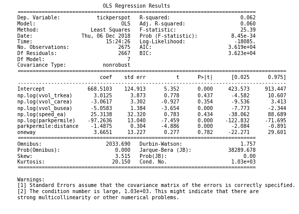

# San Francisco Parking Ticket Analysis
Project Organization
---------
```
.
├── README                        <-The top level README
├── data
│   ├── processed                 <-Processed Data used for final analysis
│   └── raw                       <-Raw Data from multiple 3rd party source
|
├── notebooks                     <-Jupyter notebooks. Naming convention is in numbered ordering.
|
├── reports                      <-Generated analysis
│   └── figures                  <-All Figures used in README or generated from analysis
|
|
└── src                         <- Source code for use in project
    ├── analysis                <-Scripts to run analysis
    │   ├── analysis_initial.py
    │   ├── analysis_park.py
    ├── data                    <-Scripts to generate data
    │   ├── create_data.py
    ├── explore                 <-Scripts to generate exploratory images and charts
    │   ├── explore_data.py
    ├── extras                  <-Extra Project Features
    │   ├── extras.py
    └── __init__.py             <- makes src a Python Module

```

## Project Workflow


## Project Walkthrough


## Goal
In order to get a residential parking permit in San Francisco, you must change your address on your both your license and vehicle registration. With a transient person such as myself switching locations every year, a broken online system for changing your address, and deadlines for each permit that change at random schedules (There is hardly a discounted rate for a permit that expires in one month), I often have found myself trying to play the odds on where I could park my car and for how long. As you'll see in the exploration notebook, I have been very unsuccessful in these attempts. Throughout all of these failed attempts I have developed one main theory that I would like to test. The hypothesis is that streets with higher volume are less susceptible to residential overtime tickets, a product of traffic enforcement officers fearing the very traffic they patrol. While exploring that main theory, I also looked at a few other theories that I generated while exploring the data.

## Data Collection
I filed a public data request from San Francisco asking for a years worth of parking ticket data. They gave me over twice as much as I had asked for, almost 3 million tickets in total. They also provided a text file of all block limits and street intersections, as well as a decoder for what issueing agencies ID's were.

In order to pair this with the street volume, I would need a geospatial conversion. I used a list of over 200,000 reverse geocoded San Francisco addresses from https://openaddresses.io/. Any addresses I could not generate from this table, used the OpenStreetMap API to look up.

I also found a planning neighborhood zoning map so I could associate each address with a district.

For traffic volume, I went to the San Francisco County Transportation Authority. They are the keepers of a model called SFCHAMP, the official travel forecasting tool for San Francisco.You can read more about the forecasting model[here](https://www.sfcta.org/modeling-and-travel-forecasting). They were able to provide me a historical travel pattern estimate from this model, in the form of a shapefile.


While I was at it, I found the street cleaning routes from openDataSF.com, also in shapefile form.[link] (https://data.sfgov.org/City-Infrastructure/Historical-Street-Sweeper-Scheduled-Routes/u2ac-gv9v)


## Data Cleaning Process
Because of the large nature of the database, it was stored in SQLite. The finished Schema is shown below.


The whole cleaning process can take up to about 3 hours. I have made both raw and processed data available here for download.


In order to get a relational database that could pair a ticket with a street id, the first task was to associate an address with every ticket. The ticket data does not include the street suffix, which will cause more issues later on, but for now that means we would like to strip out just the street name from the address data so we have something to join on. Then we can use this table to query against what doesn't match. We'll then find what doesn't match, and we'll look for "similar" addresses. These will be addresses that share a street name, are on the same block(address rounded to 100 ), and block side (Odd or even).

Another entry error will be when the officer just writes down the cross streets, and not a full address. I used the street block limits table to create a dataframe of the addresses for all intersections, and was able to use this table to associate an address with these entries.

Any address that was not able to create a match after these steps was appended to a list of missing addresses, We used the block limits table to estimate what the suffix would be, and then searched using OpenStreetMap. After we had our full list of addresses with coordinates, I used some shapely functions to associate each one with a neighborhood on the map. This will be used when processing the ticket data.

Now that we have the address data, we will loop through all tickets and associate them with an address. We will process them in chunks of 500000 records, and filter only on tickets we can associate an address with.However, the aspect of not including the street suffix now poses a problem.  Some street names can have multiple records for the same number because they have two alternatives of suffixes (IE 01ST STREET and 01ST AVENUE). This is an issue as there really wasn't any indicators as to which one it was, so a few general assumptions had to be made based on domain knowledge.

We know that no avenue after 15th is residential permit(unless its numbered 2200 - 2600 which can go up to 21st), so we can assume those are 'ST' Anything else over 21st will be assumed ST. For the rest, we'll query all the neighborhoods that specific ticket issuer was at during that day in time(for addresses we know, IE single valid address). We'll then sort the list of potential addresses based on how close the issueing time was to the ticket we are trying to look up. We then use the sorted list to re-index the potential addresses based on the associated neighborhoods. We'll choose the closest. If there's no matches (IE they didn't show up in either neighborhood, we'll choose one randomly based on how many addresses are at each street)

Once we had processed ticket data, we need to find a way to connect it to the street volume data. The street volume data does not include address limits, but it does include the street name. The street cleaning file does have the address limits. So what I did was join the two shapefiles together, and filter only on matches that have the same street name. The rest will have to use a closest distance function. Now we can merge our street cleaning data using our street and number. Then we can associate it with the street volume id that was This will allow us to associate every ticket with a valid address to a valid street volume data point. A street id was created on the geodataframe, and it was then saved as a different file so we can save the identification that matches our street index and use it later properly. The street volume data points were also stored in the SQLite Database.

Once these tables were created, we now had a relational database that can be used to answer our main problem.

## Initial Exploration Findings
(few interesting initial)
First I did some exploratory analysis just to look for some interesting takeaways in the data, as well as ensure the data was processed properly and no major holes existed. There are quite a few graphs generated in the notebooks, so I placed them in a separate [readme file](src/explore/README.md) in the explore data older.


## Testing The theory

Question 1:
Do streets with higher volumes of traffic get less tickets?

Now for the main event. Let's use our finished sql database to associate the total number of residential overtime tickets associated with each street link. First, we'll try to verify our cleaning process. Let's compare a map of all the streets that we've identified as residential overtime, compared with a true map of San Francisco Residential Areas.


Then we can see if there is any significant differences between streets that have higher volumes. In order to make a 'fair' comparison by street, we'll convert the total tickets into total tickets per linear mile per year, using the distance of the street link.
We'll create some high level plots to see if we can notice the effect we're looking for, before doing any specific tests. We'll also test the normality of our data. Both Street Volume and Total Tickets were best normalized by log-fitting the data. However, this does not eliminate that a large portion of the streets do not show any volume at all.


Let's also look at the scatter plot of total tickets vs street volume.


At first, it visually appears there is a trend declining as street volume increases. However,it is noticeable that there is still a large portion of the data that remains low, and does not follow the trend.

We'll also create a new measure,tickets per mile per year (which I'll just refer to as tickets per mile), which accounts for the total distance of the street link as well as the number of tickets. This will attempt to account for streets that are longer and will be unbias in the amount of parking spots available. This measure also needed to be log-fit to normalize the data.  The first test will be to split the data right down the middle, into two populations. The higher volume streets and the lower volume streets. We'll compare the population means and see if there is any difference, then we'll run a paired t-test and see if the difference is significant.


The two populations don't seem to have major differences at a high level view. We do notice slightly more variability in the higher population, and more extremely low outliers in the lower. The t-test comes back as insignificant with a value of .591, so we cannot reject the hypothesis that they have equal means. In fact, the average for the lower volume streets is actually about 4% lower.

Because we'd like to see if this is a practical rule of thumb we can use in every day parking, we can make use of boot strapping to create simulated results how effective using this in your decisions would be. You won't always be able to choose from 5,000 different street blocks, so we'll sample each population group and assume you can pick from 20 different streets, and you take the median of the streets sampled. By iterating this decision process a thousand times for each population group, we can create a normal curve for each population group that accurately reflects the differences in choosing from each population.

We're going to split the population into four groups, or quartiles, by their rank in street volume, and run this test. Here is when we start to notice that it is the highest quartile that seems to have a lower average of tickets per mile.


I decided to break down populations even more granular, into 10 populations by order of their street volume rank. In this chart, we notice an even stronger effect in the higher populations than those of the more average. Our top 3 populations are all some of the lowest. We also notice a lower group in terms of street volume shows up with lower tickets per mile as well.  


Once we've confirmed our theory that their is a link between street volume and total tickets, we can try to fit a model that will be a little more specific. Let's see if we can include any more of the features that were available in the street volume data to create a better model. I created an Ordinary Least Squares Regression model that split out the volume into cars, trucks, and buses,as well as freeflow speed. The results showed there is a significant effect from each variable. However, it can't really describe much of the variability, with an extremely low r-squared value. It also showed buses and speed we're a little more significant of variables.


But I wanted to see if using this model would actually create some tangible results. So I re-indexed the streets, but using the fitted value to set their rank. We can then re-do our simulated experiment, and see if using this model to make our decisions would actually result in choosing the correct streets. Below is the result, splitting into 10 populations, and re-doing our bootstrapping analysis.


The results are strong! There is a clear effect that the streets we fit to receive less tickets actually do. By using this model to identify our best streets, we can reduce the average number of tickets by up to 50%!! We also notice there is much less variability for the populations we predicted to have lower amounts of tickets. This is a great indicator that the predictions get more accurate when looking for the streets we are most interested in identifying. Let's take a deeper dive into the details of the model, with some diagnostic plots.

The Q-Q plot shows the relationship might not be as linear as we expected, so we'll re-run the process but using the logarithmic values of each of our variables.


The resulting model had a slightly higher r-squared, indicating its a better fit. The diagnostic plots show there is still a a pattern in the residuals, however,  that we haven't completely eliminated. But it seems we have mitigated a few of our outliers. When re-running the experiment, the results seem to be pretty similar to before, with lower means and variability for the populations we look to identify.


## Findings
Although there is a significant degree of uncertainty and variability, we can create a model that will estimate the amount of residential overtime tickets per street per year, and those results will be directionally accurate. If we assume that all other factors are equal. We can reduce the amount of tickets by up to 18% by strictly parking at locations that we identify in the top 10% rather than guessing normally, and up to 37% less than if we were to choose one of the worst set of streets. The most contributing factors are freeflow speed, car volume, and bus volume.

However, this does not include parking spot availability. Note that bus volume is a much bigger factor than car volume. We know bus stops take up parking spots, so that is a clear correlation. I decided to run the analysis back, including parking availability data.


# Analysis With Parking Included

In order to avoid any bias when comparing the number of tickets per street I found a street parking availability census, also in the form of a shapefile. [link] (http://sfpark.org/resources/parking-census-data-context-and-map-april-2014/)

I used a similar pairing process as the street cleaning, using shapely joins and filtering on those that had the same street name. This just added a column to our street volume data with the parking supply quantity. Anything that didn't get a valid match(Same street name and intersection), was back filled using the average spots per mile for that respective neighborhood. This time around, we'll use the measure tickets per 100 spots per year.


 I ran the exact same analysis as before, but this time it showed me that my hypothesis was actually biased on parking availability. There didn't seem to be a measurable difference this time.


When creating a model this time, I could add parking density as a feature, and see if that had an effect. I also added the one way street identifier this time around. I then tested to see if there were any significant interaction effects, and parking density combined with distance was significant, and added accuracy to the model. The final model details are below.


By re-running our bootstrapping analysis, we can see this increased our population difference from 18% up to 40% when using this new model. This model seems to be much more accurate. If we look at at a numerical description between our worst and best fitted populations, we can confirm what the model was looking for.


The worst fitted population had smaller distances, lower parking supply, lower speeds, and lower volume. One Way streets had a significant difference, increasing the average number of tickets. Higher parking density was also a huge difference for the best streets compared to the worst. Maybe this could be because it requires them to look much harder for the residential permit, located on the bumper, for types of streets that are bumper to bumper and have higher volume. These streets tend to be on less 'residential' blocks, where no driveways exist, and would also most likely have...higher volume. So, by including parking supply I may have confirmed my initial findings, but expanded upon a deeper meaning in it.

In conclusion, we can take millions of records of ticket data, pair it with street volume types, and parking density, and we can identify which streets are best to park at when trying to avoid a residential overtime ticket. The other option would be to buy a residential permit, but that's your choice.

## Question 2:
How long can I park without getting a ticket?

This one is much more theoretical, and I thought I would try to solve as a little extra since I had some data available. In reality, I would need more data to be able to answer this concretely, such as information on how long each car was parked, as well as information on cars that didn't get tickets.  However, I can still try and take a stab at it using some high level numbers.

First, lets clarify the assumptions and process for estimating this probability. There are two parts we must solve in this question. The first part is the probability that they come down the street you are parked in. This probability will increase with time. The second includes the probability they come back, and in what time frame.

Part 1.
We'll assume the same success rate of each street, as in every X parking spots he passes on any street, they'll get one. But how do we arrive at this? We'll need some very high level estimates. First, we'll estimate the total number of spots they cumulatively pass in a day that are residential overtime.

We'll assume he travels roughly 50% of the weighted average freeflow speed (while he is looking for offenders), as from visual estimates. We'll also take the ratio of total streets that are residential vs. non-residential to estimate how many residential spots he'll pass per day, assuming he travels all streets equally and taking the average of spots available per mile. We'll take his total spots by combining these ratios over 6 hours a day (assuming they do one 2 hour street clean route each day). We'll also take time out for writing tickets, ~ 2 minutes each, and assume he is about 75% utilized. You can change any of these inputs by running

Now, we'll need to find total residential parking spots. We can't simply query the total amount of distinct addresses because one spot can be associated with multiple addresses. So what we'll have to is take the average number of spots per street and multiply it by the total number of unique streets that got tickets.

Now we can simply create an estimate of how many times they check each spot, over an average day. This will be used as our arrival rate. We'll split these checks over 10 hours, because most go for 12 hours, but if you park after the 10th you can't get a ticket because it will be less than 2 hours before until time is up. We get they will check each spot an average of 7.6 times per day.


Part 2.
On each ticket, they write down what time they first came and marked your car, and then what time they wrote the ticket. This implies they have a list of which cars they marked and where, and attempt to go check on them. Unfortunately, the initial time checked and the time returned were not included in the data. We will have to look for special circumstances under which we can find a distribution. We will look for circumstances where a ticketing officer wrote two tickets on the same street, but not within roughly 2 and 4 hours  of each other. this is under the assumption he marked the first car after he wrote the second. We'll only look for the distribution between 2 and 3 hours, and use that. The distribution is shown below.


Now using some Bayesian methodologies, we can combine these two distributions and create one probability distribution over time for the average SF Street. Below is a cumulative Distribution Plot of receiving a residential overtime ticket versus time at that spot.


However, this study was based around the variability of arrival rates by streets, so lets use the arrival rates from our least and most patrolled streets, categorized from our regression model.


Let's plot the the probability of each population segment and see there differences. Here we have to assume the arrival rate is directly proportional to how many tickets per spot are given out. Now let's only look at the average, worst, and best, and add 90% Confidence Interval bands.


You can see that the variability really is much more important on the lower side. IE 1 unit lower does much more good than moving 1 unit up harms. So by selecting the right streets, you can drastically reduce your chances.

## Street Cleaning Analysis
As you can see in the exploratory notebook, residential overtime tickets are not my only foe. Street Cleaning actually makes up for an overwhelming majority of the tickets that are given out. I have a few things I would like to test:
1. Streets cleaned on a consistent basis give less tickets 'per sweep', than those that are less consistent(IE every other week).
2.  Although a majority of the street cleaning tickets are given out between 8-10AM, I think that's just because there are more streets that are cleaned at time. Lets see if that's substantiated.
3. Streets cleaned on Saturday and Sunday are more effective.

For this, I created a measure for each street called "success rate", which effectively is tickets given per mile swept. This combines the distance of the street link, and the frequency of sweeps per year. When can then chart the success rate of street links by how many times they are swept per month.

1.  Below shows that as streets are cleaned more consistently, their "success rate" declines. Note that some streets may be cleaned 7 Days a Week by 5 weeks, showing up as 35 days here. That would not truely be the case, However, they are still significantly lower.  


2. The chart below shows success vs time cleaning started. We see that morning sweeping, and overnight are most effective.


3. Below shows chart of success rate by day of week. Seems like most people get caught off guard on the weekends.


## Few Extra Deliverables
Query Heatmap -- This function will take your query arguments, and return a heatmap of all records found. This is actually located in the exploratory sections.
An example can be found [here](/reports/figures/maps/ViolationDescRESOT.html)


Animation Function -- This function will take a day as an argument, and look up all tickets given out on that day. It will then create an animation video of tickets, showing up as points on the map, in the order they were given out. They will be colored by their ticket type.

Recent Street Cleaning - This will take an address as an argument, and return the closest streets that were swept that day. These are typically easier to park in. Optional argument for streets that have never gotten a 'Residential Over Time Ticket'.

Estimated Sweeping Time --Finding a spot is a tough gig in San Francisco, so I've found the best practice is to know when the sweeping truck is coming by and try to follow him. Unsurprisingly, I'm not the only one who does this and it usually results in a death match between all cars. If you put in an address here, I'll give you an estimate as well a confidence interval on the range of times I would expect the truck to arrive, so you don't have to sit around and wait. I'll use the last ticket of each day when one was given out for that street link.

Map the Sweeping route -- This will create a map of the sweeping route, colored by the arrival time of the street sweepers , so you can see where to catch him next. This will create both an HTML color coded map as well as a live graph.

Map the Model - This will allow you to take our fitted model, and visually compare it against a real sample of residential overtime tickets. Colored from highest to lowest estimated values, the hope is that a majority of the tickets would be on the 'redder' streets. Try it our for yourself.
